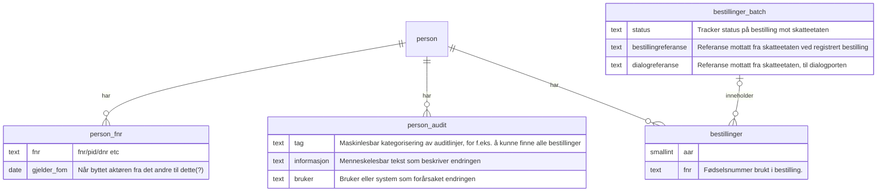

# sokos-skattekort

Sokos-skattekort er en erstatning for os-eskatt, som brukte altinn 2 til å hente skattekort. I løpet av høsten 2025 vil skatteetaten tilby et nytt grensesnitt, separat fra altinn, for å
tilby samme funksjonalitet.

## Funksjonell workflow


## Workflows

1. [Deploy alerts](.github/workflows/alerts.yaml) -> For å pushe alarmer for dev og prod
    1. Denne workflow trigges bare hvis det gjøres endringer i [alerts-dev.yaml](.nais/alerts-dev.yaml) og [alerts-prod.yaml](.nais/alerts-prod.yaml)
2. [Deploy application](.github/workflows/deploy.yaml) -> For å bygge/teste prosjektet, bygge/pushe Docker image og deploy til dev og prod
    1. Denne workflow trigges når kode pushes i `main` branch
3. [Build/test PR](.github/workflows/build-pr.yaml) -> For å bygge og teste alle PR som blir opprettet og gjør en sjekk på branch prefix og title
    1. Denne workflow kjøres kun når det opprettes pull requester
4. [Security](.github/workflows/codeql-trivy-scan.yaml) -> For å skanne kode og docker image for sårbarheter. Kjøres hver morgen kl 06:00
    1. Denne kjøres når [Deploy application](.github/workflows/deploy.yaml) har kjørt ferdig
5. [Deploy application manual](.github/workflows/manual-deploy.yaml) -> For å deploye applikasjonen manuelt til ulike miljøer
    1. Denne workflow trigges manuelt basert på branch og miljø

## Bygge og kjøre prosjekt

1. Bygg prosjektet ved å kjøre `./gradlew clean build shadowJar`
2. Start appen lokalt ved å kjøre main metoden i ***Application.kt***
3. For å kjøre tester i IntelliJ IDEA trenger du [Kotest IntelliJ Plugin](https://plugins.jetbrains.com/plugin/14080-kotest)

## Utviklingsmiljø

### Forutsetninger

* Java 21
* [Gradle >= 8.9](https://gradle.org/)
* [Kotest IntelliJ Plugin](https://plugins.jetbrains.com/plugin/14080-kotest)

### Bygge prosjekt

1. Bygg prosjektet ved å kjøre `./gradlew clean build shadowJar`

### Lokal utvikling

2. Start appen lokalt ved å kjøre main metoden i ***Application.kt***
3. For å kjøre tester i IntelliJ IDEA trenger du [Kotest IntelliJ Plugin](https://plugins.jetbrains.com/plugin/14080-kotest)

### Patching av biblioteker

Vi har ikke testdekning på IBM MQ-bibliotekene (gruppe "com.ibm.mq" i build.gradle.kts) fordi vi kjører activemq i stedet for ibm mq i test-modus.
Vi må teste oppgradering av dette/disse biblitekene manuelt.

## Programvarearkitektur

### Oversikt


Applikasjonen integrerer også med drifts- og observabilitetsverktøy.

### Interne grensesnitt

Ingen

### Versjonerte grensesnitt

| Funksjon     | Type      | Nåværende versjon | Kanal for funksjonelle ønsker | Kanal for varslinger om versjoner          | Kanal for drifts- eller utviklingsrelatert kommunikasjon |
|--------------|-----------|-------------------|-------------------------------|--------------------------------------------|----------------------------------------------------------|
| bestillinger | MQ        | TBD               | #utbetaling                   | #utbetaling-sokos-skattekort-announcements | #utbetaling-sokos-skattekort                             |
| Arena        | Filområde | TBD               | #utbetaling                   | #utbetaling-sokos-skattekort-announcements | #utbetaling-sokos-skattekort                             |
| OppdragZ     | MQ        | TBD               | #utbetaling                   | #utbetaling-sokos-skattekort-announcements | #utbetaling-sokos-skattekort                             |

TBD Hva er url til swagger i Lokal, dev og prod? Dok for grensesnitt.

### Maskinporten og systembrukere


```kotlin
private fun createJwtAssertion(issuer: String): String {
    val jwt =
        JWT
            .create()
            .withIssuer(maskinportenPropertoes.clientId)
            .withAudience(issuer)
            .withClaim("scope", maskinportenPropertoes.scopes)
            .withExpiresAt(
                Date(
                    Instant
                        .now()
                        .plus(timeLimit)
                        .toEpochMilli(),
                ),
            ).withIssuedAt(Date())
            .withKeyId(maskinportenPropertoes.rsaKey?.keyID)
            .withJWTId(UUID.randomUUID().toString())

    //Magic is here
    val additionalClaims = getSystembrukerClaim(maskinportenPropertoes.systemuserOrg)

    additionalClaims.forEach { (key, value) ->
        jwt.withClaim(key, value)
    }

    return jwt.sign(Algorithm.RSA256(null, maskinportenPropertoes.rsaKey?.toRSAPrivateKey()))
}
fun getSystembrukerClaim(orgNr: String) =
    mapOf(
        "authorization_details" to
            listOf(
                mapOf(
                    "type" to "urn:altinn:systemuser",
                    "systemuser_org" to
                        mapOf(
                            "authority" to "iso6523-actorid-upis",
                            "ID" to "0192:$orgNr",
                        ),
                    //"externalRef" to "$systemuserRef" hvis det finnes flere systembrukere for systemet (utestet)
                ),
            ),
    )
```

#### Morsomme lenker

System som er opprettet:
https://platform.tt02.altinn.no/authentication/api/v1/systemregister/889640782_nav_okonomi (edited)

Denne er offentlig tilgjengelig, åpent for alle, men viser ikke uuid til tilknyttede maskinporten-klienter

Opprette systembruker som daglig leder: https://authn.ui.tt02.altinn.no/authfront/ui/auth/creation

Dokumentasjon for å lage system: https://docs.altinn.studio/nb/api/authentication/systemuserapi/systemregister/create/

Dokumentasjon for systembrukere: https://docs.altinn.studio/nb/api/authentication/systemuserapi/systemuser/

Hente systembrukere for et system: https://docs.altinn.studio/nb/api/authentication/systemuserapi/systemuser/external/#list-opp-alle-systembrukere-for-en-system

Systembruker-dok fra skatteetaten: https://skatteetaten.github.io/api-dokumentasjon/om/systembruker


Orgnr for systembruker i test:
 - Orgnr: 312978083
 - Fnr: 07916598100 (Daglig leder, brukes for å godkjenne)

### Statemaskin for bestillinger

#### bestilling


### Databaseskjema

#### Person og bestilling



#### Forespørsel fra forsystem


#### Skattekort (skisse)


## Deployment

Distribusjon av tjenesten er gjort med bruk av Github Actions.
[sokos-skattekort CI / CD](https://github.com/navikt/sokos-skattekort/actions)

Push/merge til main branch vil teste, bygge og deploye til produksjonsmiljø og testmiljø.

## Autentisering

Applikasjonen bruker [AzureAD](https://docs.nais.io/security/auth/azure-ad/) autentisering

## Drift og støtte

Applikasjonen driftes av utviklerteamet under en devops-modell.

Applikasjonen kjører onprem.

### Logging

https://logs.adeo.no.

Feilmeldinger og infomeldinger som ikke innheholder sensitive data logges til data view `Applikasjonslogger`.  
Sensetive meldinger logges til data view `Securelogs` [sikker-utvikling/logging](https://sikkerhet.nav.no/docs/sikker-utvikling/logging)).

- Filter for Produksjon
    * application:sokos-skattekort AND envclass:p

- Filter for Dev
    * application:sokos-skattekort AND envclass:q

### Kubectl

TBD

### Alarmer

Vi bruker [nais-alerts](https://doc.nais.io/observability/alerts) for å sette opp alarmer.
Disse finner man konfigurert i [.nais/alerts-dev.yaml](.nais/alerts-dev.yaml) filen og [.nais/alerts-prod.yaml](.nais/alerts-prod.yaml)

### Grafana

---

## Henvendelser og tilgang

- Spørsmål knyttet til koden eller prosjektet kan stilles som issues her på github.
- Funksjonelle interne henvendelser kan sendes via Slack i kanalen [#utbetaling](https://nav-it.slack.com/archives/CKZADNFBP)
- Utvikler-til-utviklerkontakt internt i NAV skjer på Slack i kanalen TBD
