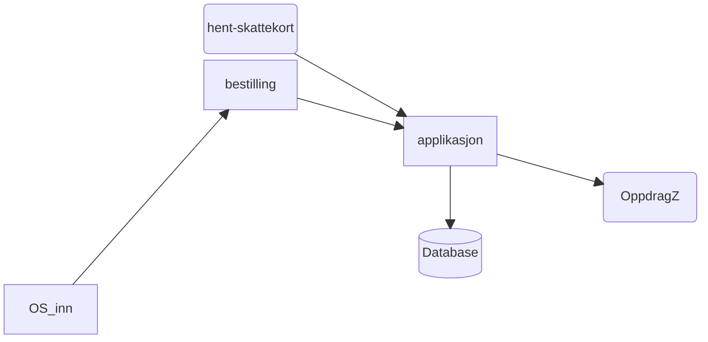

## Programvarearkitektur

### Oversikt

Applikasjonen integrerer også med drifts- og observabilitetsverktøy.

### Interne grensesnitt

Ingen

### Versjonerte grensesnitt

| Funksjon                         | Type      | Navn QA                           | Nåværende versjon | Kanal for funksjonelle ønsker | Kanal for varslinger om versjoner          | Kanal for drifts- eller utviklingsrelatert kommunikasjon |
|----------------------------------|-----------|-----------------------------------|-------------------|-------------------------------|--------------------------------------------|----------------------------------------------------------|
| bestillinger fra OppdragZ        | MQ        | QA.Q1_OS_ESKATT.FRA_FORSYSTEM_ALT | TBD               | #utbetaling                   | #utbetaling-sokos-skattekort-announcements | #utbetaling-sokos-skattekort                             |
| "store bestillinger" (ved nyttår | MQ        |                                   | TBD               | #utbetaling-sokos-skattekort  | #utbetaling-sokos-skattekort-announcements | #utbetaling-sokos-skattekort                             |
| Skattekort til OppdragZ          | MQ        | QA.Q1_231.OB04_FRA_OS_ESKATT      | TBD               | #utbetaling-sokos-skattekort  | #utbetaling-sokos-skattekort-announcements | #utbetaling-sokos-skattekort                             |
| Hent skattekort (salesforce)     | Rest      |                                   | V1                | #utbetaling                   | #utbetaling-sokos-skattekort-announcements | #utbetaling-sokos-skattekort                             |

Swagger

- [Dev-fss](https://sokos-skattekort.intern.dev.nav.no/api/v1/skattekort/docs)
- [Lokalt](http://0.0.0.0:8080/api/v1/skattekort/docs)

### Maskinporten og systembrukere

Systembrukere er objekter som eies på NAV-nivå, og føringer/ideer fra NAV sentralt har fått oss til å håndtere systembrukere
som [delt konfigurasjon](https://confluence.adeo.no/x/Av8ML) i seksjon utbetaling.
