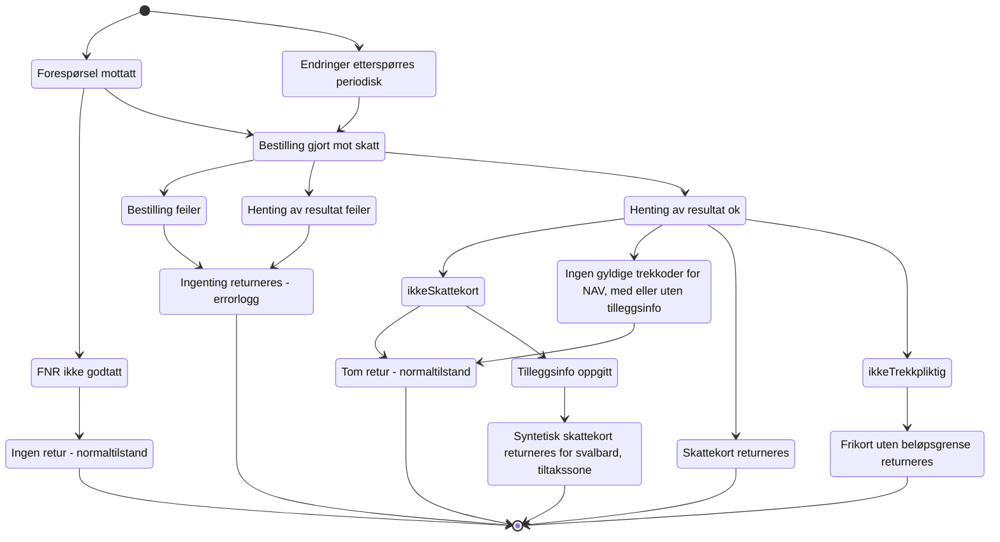

# Returer gitt i forskjellige situasjoner

```mermaid
stateDiagram-v2
    state "Forespørsel mottatt" as fm
    state "Endringer etterspørres periodisk" as endring
    state "FNR ikke godtatt" as not_fnr
    state "Ingen retur - normaltilstand" as ingen_retur
    state "Tom retur - normaltilstand" as tomt_normal
    state "Bestilling gjort mot skatt" as best_sendt
    state "Bestilling feiler" as best_feiler
    state "Ingenting returneres - errorlogg" as error
    state "Henting av resultat feiler" as henting_feiler
    state "Henting av resultat ok" as henting_ok
    state "Ingen gyldige trekkoder for NAV, med eller uten tilleggsinfo" as tomt_kanskje_tillegg
    state "ikkeSkattekort" as ikkeSkattekort
    state "ikkeTrekkpliktig" as ikkeTrekkplikt
    state "Tilleggsinfo oppgitt" as tomt_med_tillegg
    state "Syntetisk skattekort returneres for svalbard, tiltakssone" as synt
    state "Frikort uten beløpsgrense returneres" as synt_frikort
    state "Skattekort returneres" as retur

    [*] --> fm
    [*] --> endring
    endring --> best_sendt
    fm --> not_fnr
    not_fnr --> ingen_retur
    fm --> best_sendt
    best_sendt --> best_feiler
    best_feiler --> error
    best_sendt --> henting_feiler
    henting_feiler --> error
    best_sendt --> henting_ok
    henting_ok --> ikkeSkattekort
    ikkeSkattekort --> tomt_normal
    henting_ok --> tomt_kanskje_tillegg
    tomt_kanskje_tillegg --> tomt_normal
    ikkeSkattekort --> tomt_med_tillegg
    tomt_med_tillegg --> synt
    henting_ok --> retur
    henting_ok --> ikkeTrekkplikt
    ikkeTrekkplikt --> synt_frikort
    tomt_normal --> [*]
    error --> [*]
    retur --> [*]
    synt --> [*]
    synt_frikort --> [*]
    ingen_retur --> [*]
```