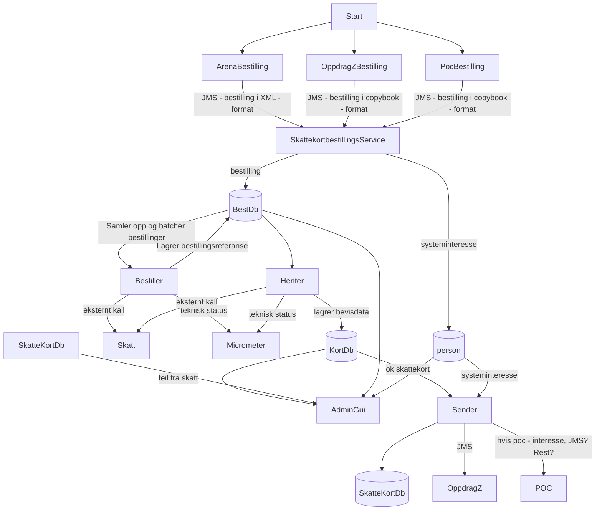
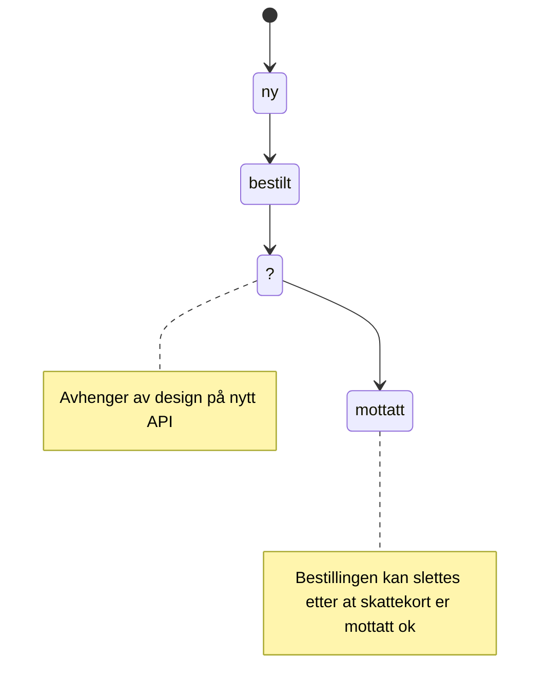
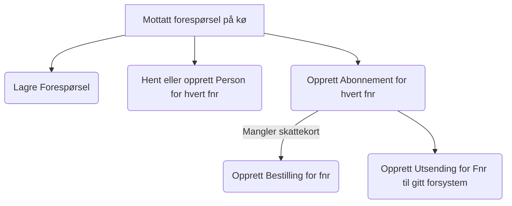
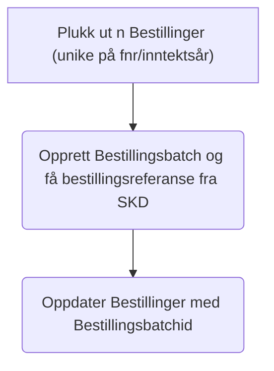
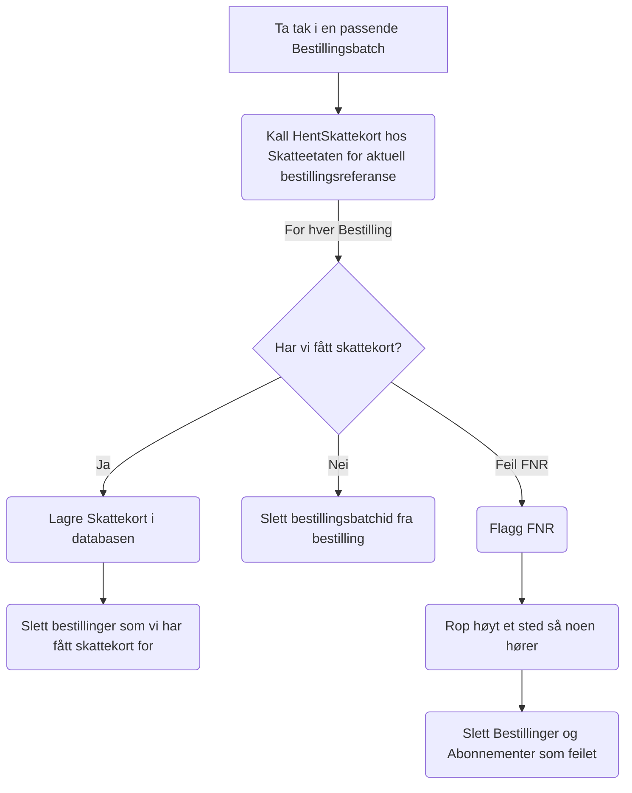
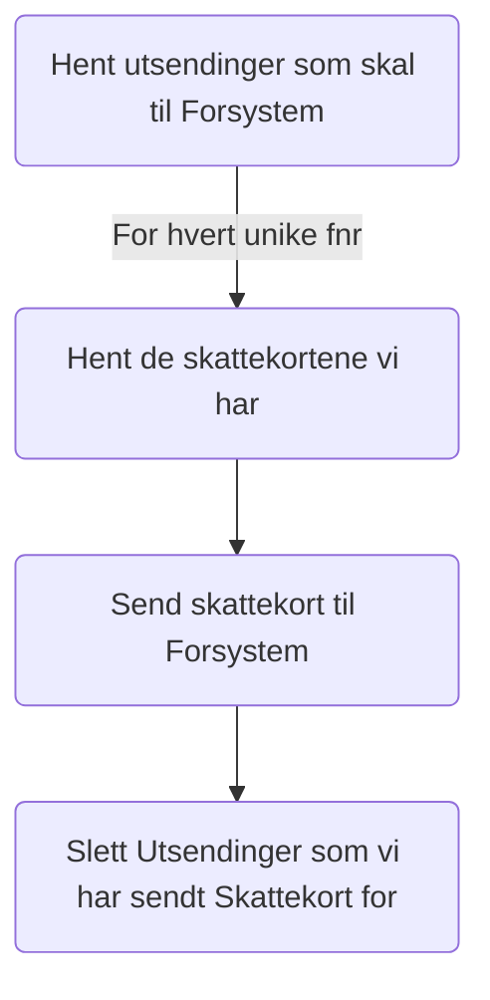
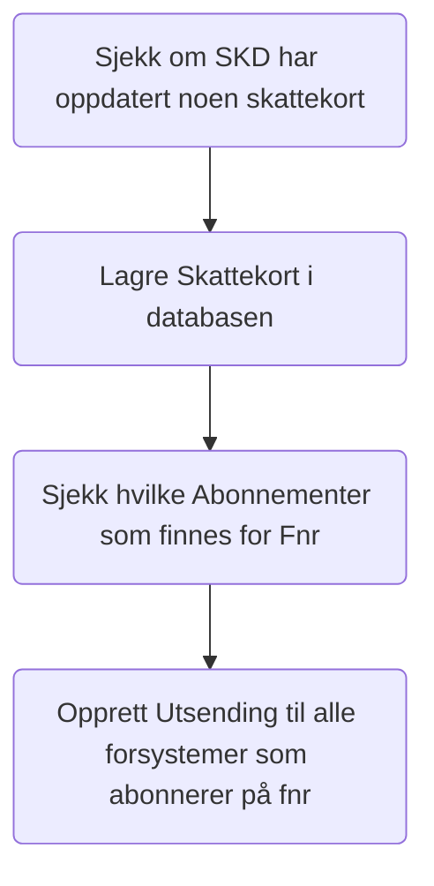
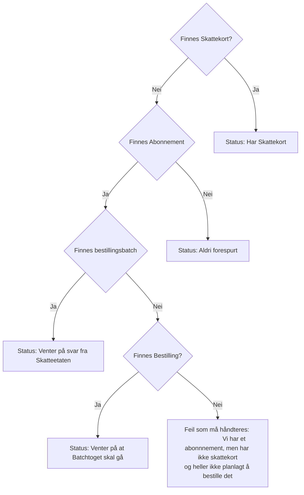

## Funksjonell workflow

## Workflows

1. [Deploy alerts](.github/workflows/alerts.yaml) -> For å pushe alarmer for dev og prod
    1. Denne workflow trigges bare hvis det gjøres endringer i [alerts-dev.yaml](.nais/alerts-dev.yaml) og [alerts-prod.yaml](.nais/alerts-prod.yaml)
2. [Deploy application](.github/workflows/deploy.yaml) -> For å bygge/teste prosjektet, bygge/pushe Docker image og deploy til dev og prod
    1. Denne workflow trigges når kode pushes i `main` branch
3. [Build/test PR](.github/workflows/build-pr.yaml) -> For å bygge og teste alle PR som blir opprettet og gjør en sjekk på branch prefix og title
    1. Denne workflow kjøres kun når det opprettes pull requester
4. [Security](.github/workflows/codeql-trivy-scan.yaml) -> For å skanne kode og docker image for sårbarheter. Kjøres hver morgen kl 06:00
    1. Denne kjøres når [Deploy application](.github/workflows/deploy.yaml) har kjørt ferdig
5. [Deploy application manual](.github/workflows/manual-deploy.yaml) -> For å deploye applikasjonen manuelt til ulike miljøer
    1. Denne workflow trigges manuelt basert på branch og miljø

### Statemaskin for bestillinger

#### bestilling

## Prosess 1: Motta forespørsler og opprette Personer, Abonnementer, Bestillinger og Utsendinger

## Prosess 2: Bestille skattekort fra skatteetaten

## Prosess 3: Hent skattekort fra skatteetaten

## Prosess 4: Send skattekort til Forsystem

## Prosess 5: Motta oppdaterte skattekort

## Prosess 7: Slette gamle data

1. Delete from skattekort where inntektsaar < currentYear - 1
2. Delete from abonnementer where inntektsaar < currentYear - 1
3. Delete from person where not exists (select 1 from abonnementer where abonnementer.fnr = person.fnr)
4. etc

## Prosess 8: Sjekk bestillingsstatus for FNR og inntektsår

