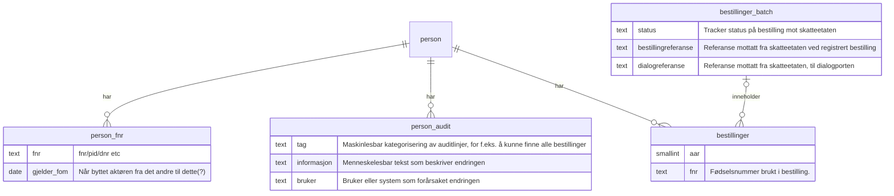

### Databaseskjema

#### Person og bestilling

Designnotater:

- vi kan få skattekort uten skattekort-deler. Det gjelder typisk personer som har tilleggsopplysninger.
- tanken bak skattekort-tabellen er at den er immuterbar. Vi endrer ikke eksisterende innslag, vi lager nye.

## Relasjonsmodell

#### Skattekort (skisse)

